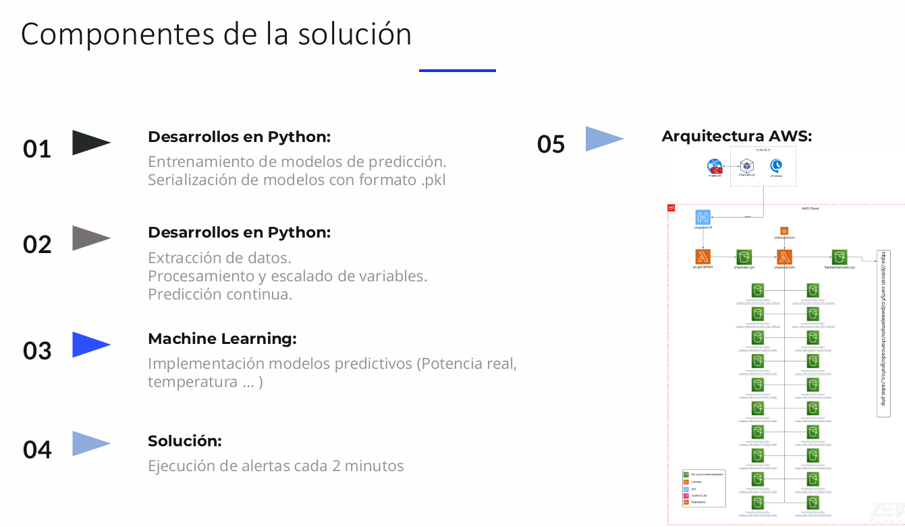
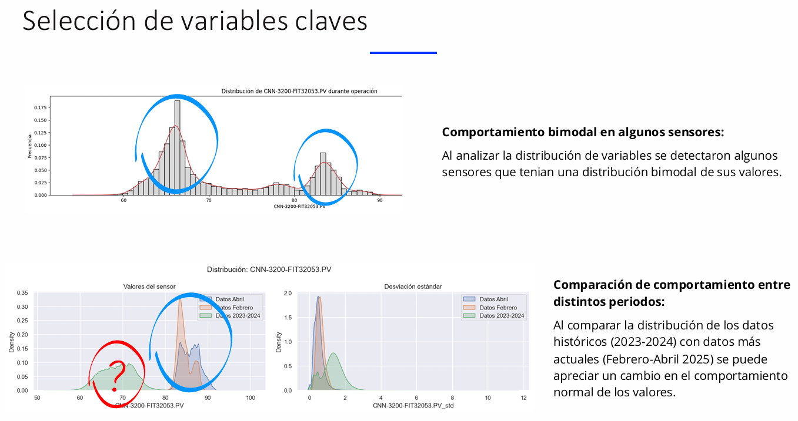
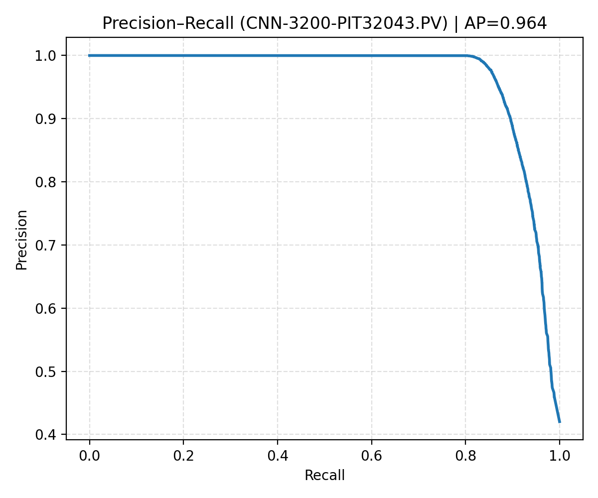
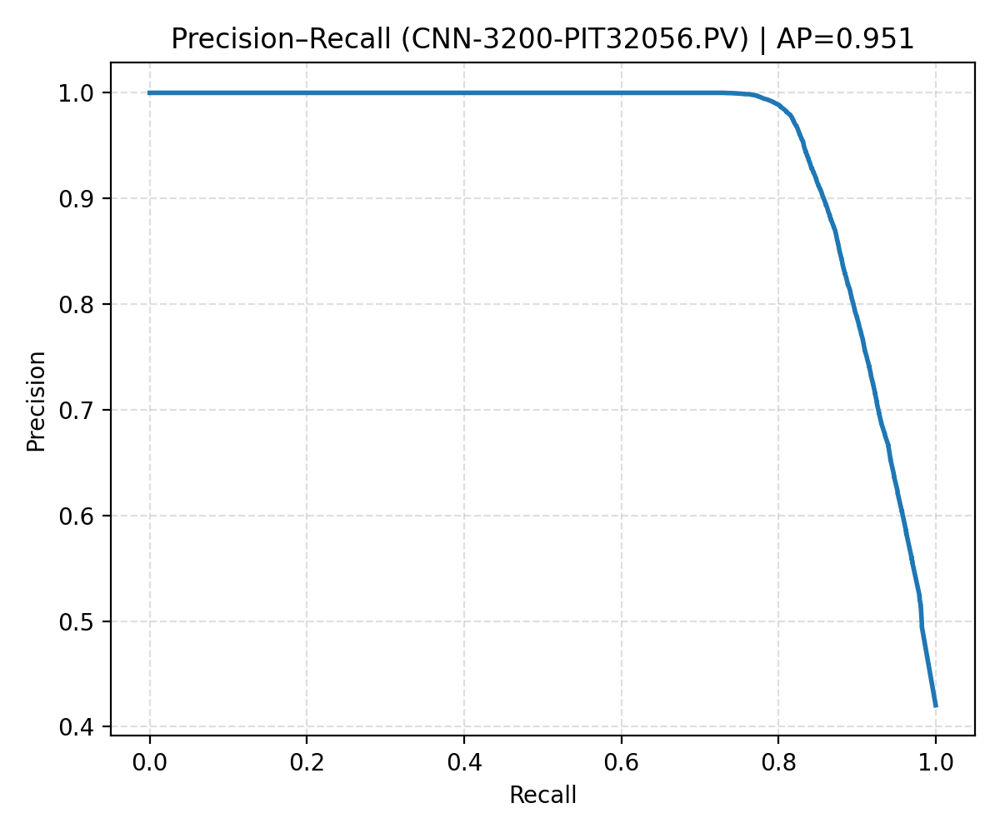
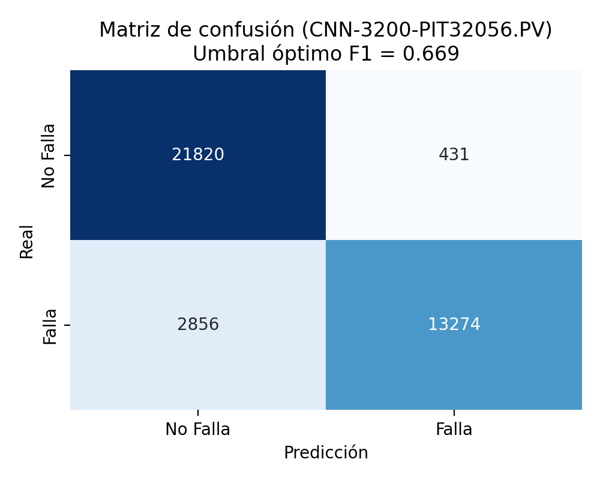
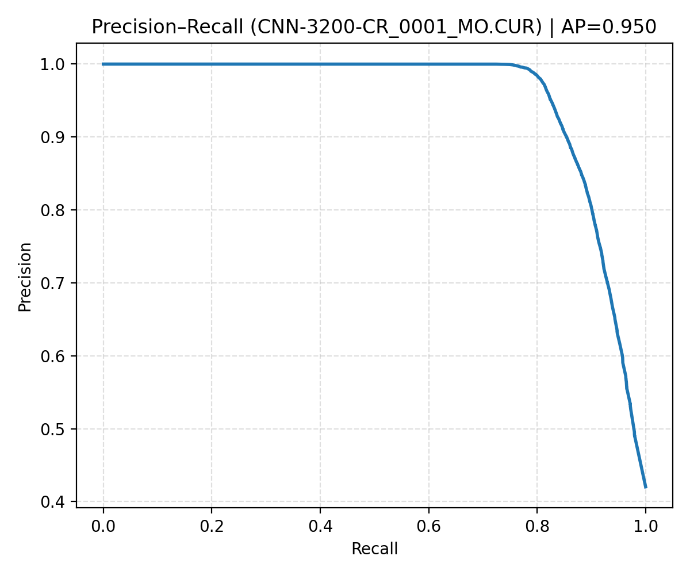
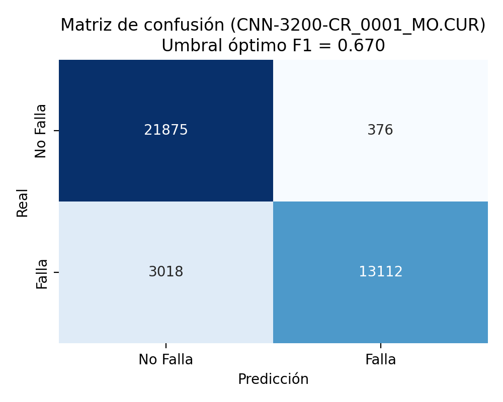

# Mantenimiento Predictivo para Chancador Primario

## Contexto
Este proyecto fue desarrollado con datos reales de operación minera, con frecuencia de 15 segundos por sensor.  
Se necesita anticipar fallas críticas para optimizar la operación, reducir paradas no programadas y disminuir costos de mantenimiento.

**Objetivo:** Detectar fallas con anticipación (15–60 min) en un chancador minero usando series de tiempo (cada 15 s).  
**Enfoque:** Modelos ML (LSTM con TensorFlow/Keras, Random Forest y XGBoost) + análisis riguroso de operación normal y umbrales.  
**Stack:** Python, pandas, scikit-learn, TensorFlow/Keras, XGBoost, matplotlib/seaborn.

**Principales Retos:**
- Datos con ruido por detenciones programadas, clima y variaciones en la carga.
- Etiquetas incompletas (fechas de fallas sin hora exacta).
- Gran volumen de datos históricos.

---

## Datos y filtros operacionales
- `RUN = 1` (CNN-3200-CR_0001_MO.RUN)
- `WIC32149.PV > 200` (material presente)
- Omitir 8 registros (≈2 min) tras transición RUN 0→1 (evitar ruido de arranque)
- Frecuencia: 15 s

---

## Metodología
1. **Filtrado operacional**:
   - `RUN = 1` (motor del chancador en funcionamiento)
   - `WIC32149.PV > 200` (material presente en la correa)
   - Exclusión de 8 registros posteriores a arranque (ruido de inicio)
2. **Análisis de operación normal**:
   - Histogramas por sensor y comparación con límites teóricos.
3. **Generación de features**:
   - Ventanas móviles de 1 min (`std`, tendencia, valores promedio).
4. **Modelos implementados**:
   - **LSTM** (detección de patrones temporales).
   - **Random Forest / XGBoost** (clasificación tabular).
5. **Estrategia de decisión**:
   - Regla A: ≥2 sensores con probabilidad > 0.7 durante 4 registros consecutivos.
   - Regla B: ≥1 sensor con probabilidad > 0.9 durante 8 registros consecutivos.
6. **Evaluación**:
   - AUC-PR, anticipación promedio, falsas alarmas/día.

---

## Imágenes Clave

**Componentes de la Solución**

**Análisis de Comportamiento de Datos**

---

## Resultados – Top 3 Sensores (Average Precision)

| Sensor | AP | F1 (umbral óptimo) | Umbral | TN | FP | FN | TP |
|---|---:|---:|---:|---:|---:|---:|---:|
| `CNN-3200-PIT32043.PV` | 0.964 | 0.911 | 0.65 | 21920 | 331 | 2352 | 13778 |
| `CNN-3200-PIT32056.PV` | 0.951 | 0.890 | 0.67 | 21820 | 431 | 2856 | 13274 |
| `CNN-3200-CR_0001_MO.CUR` | 0.950 | 0.885 | 0.67 | 21875 | 376 | 3018 | 13112 |

**CNN-3200-PIT32043.PV**  
  

**CNN-3200-PIT32056.PV**  
  

**CNN-3200-CR_0001_MO.CUR**  
  

---

## Recursos Adicionales
- [Presentación completa del proyecto](docs/Presentación%20Pr.%20Chancador.pdf)  
- Notebooks con código y análisis en la carpeta `notebooks/`
